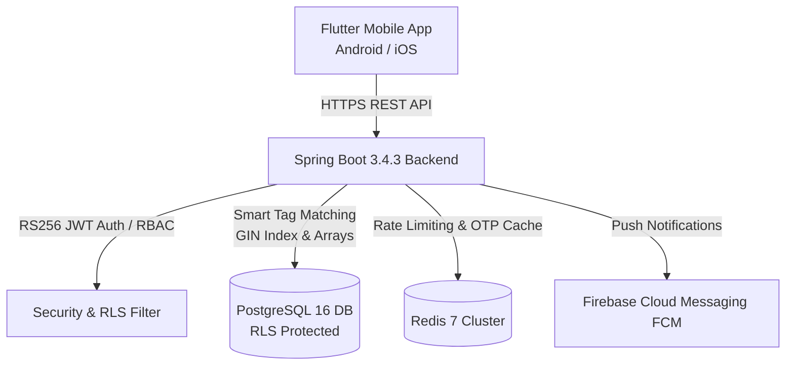
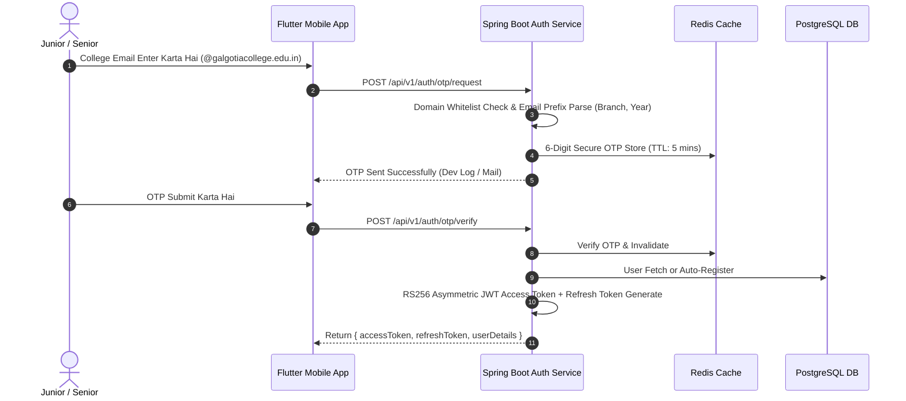
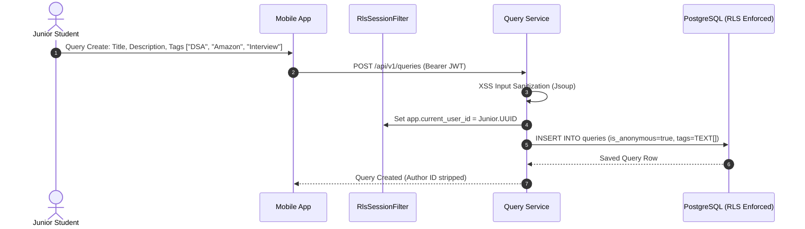
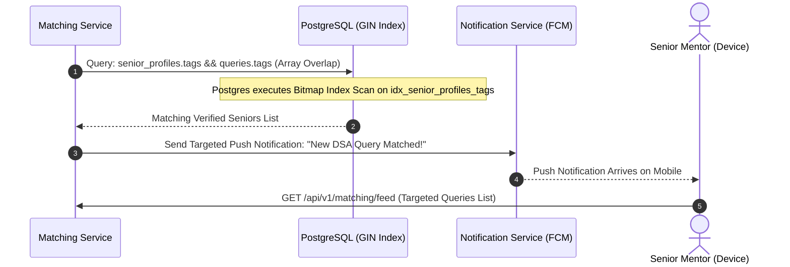
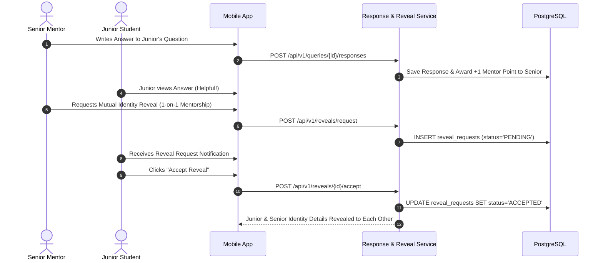
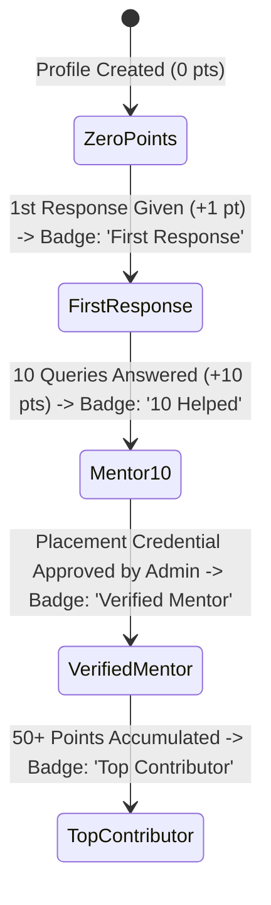
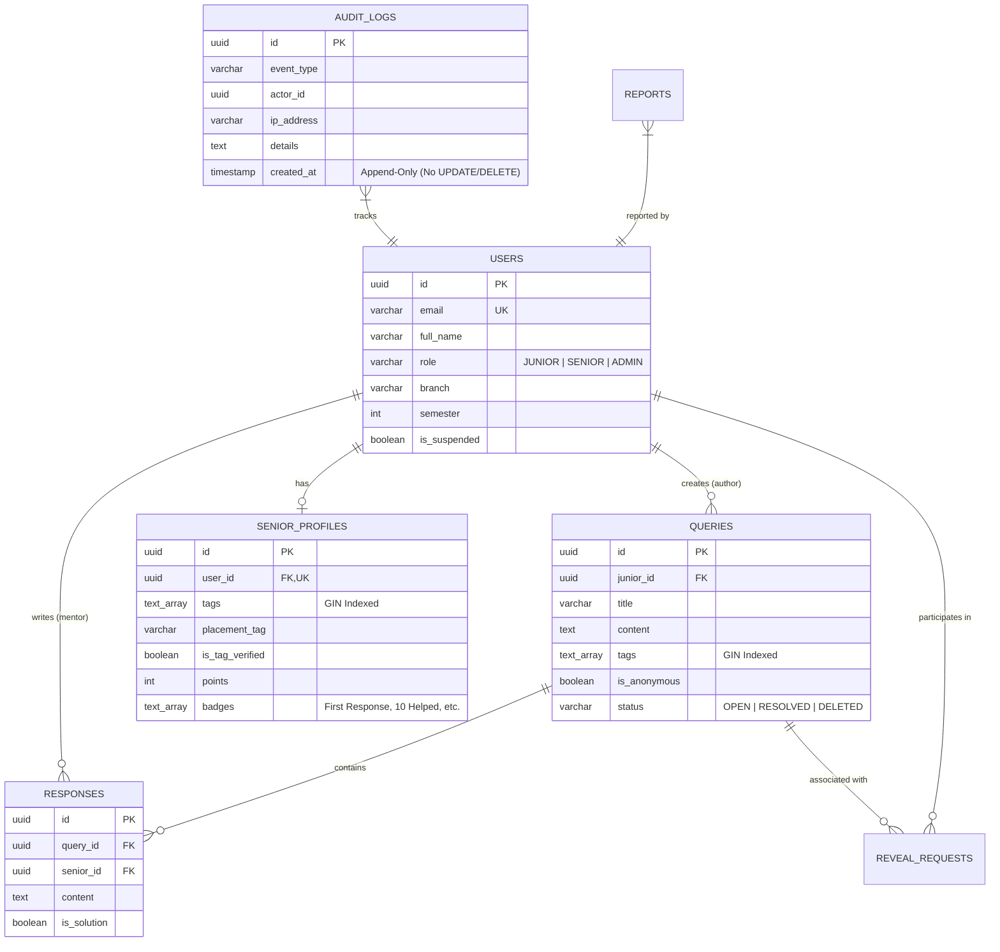

# SeniorConnect (CampusBuddy) — Complete Project Flow & Architecture Guide

SeniorConnect (CampusBuddy) ek peer-to-peer college mentorship platform hai jo **Juniors** (asking questions anonymously) aur **Seniors/Alumni** (verified mentors providing career/academic guidance) ko securely connect karta hai.

---

## 🏗️ 1. High-Level System Architecture



---

## 👥 2. User Roles & Personas

| Role | Access & Capabilities |
|---|---|
| **Junior (Student)** | - Domain-restricted college email OTP / Google login.<br/>- Anonymously queries post karna without revealing real name/branch.<br/>- Seniors ke responses dekhna aur optional **Identity Reveal** request accept/reject karna. |
| **Senior / Mentor** | - College verified domain account (Semester 5+ / Alumni).<br/>- Feed me open questions dekhna aur match feed me targeted questions receive karna.<br/>- Placement credentials verify karwa kar **Verified Mentor** & milestone badges earn karna.<br/>- Mutual reveal request initiate karna. |
| **Admin** | - Platform moderation, offensive query reports review karna, aur Senior placement verification approve/reject karna.<br/>- Append-only audit logs access karna. |

---

## 🔄 3. End-to-End Core Flows

### 📌 Flow 1: Domain-Gated Authentication & Token Rotation Flow



---

### 📌 Flow 2: Zero-Trust Anonymous Query Creation & Feed Flow



---

### 📌 Flow 3: Smart Tag Matching & FCM Notification Flow



---

### 📌 Flow 4: Senior Response & Mutual Consent Reveal Flow



---

### 📌 Flow 5: Gamification Badges & Milestone Evaluation Flow



---

## 🗄️ 4. Database Schema & Security Isolation



---

## 🚀 5. How to Run Locally

### 1. Backend (Spring Boot)
```powershell
# Navigate to backend directory
cd d:\projects\capmusbuddy\seniorconnect-backend

# Run with Maven
mvn spring-boot:run
```
*API runs at: `http://localhost:8080/api/v1`*

### 2. Full Stack with Docker
```powershell
cd d:\projects\capmusbuddy
docker-compose up -d
```

### 3. Mobile App (Flutter)
```powershell
cd d:\projects\capmusbuddy\seniorconnect-mobile
flutter pub get
flutter run
```

---

## 🧪 6. Test Suite & Verification

All 25 backend integration tests & mobile widget tests can be run via:

```powershell
# Backend (25/25 Integration & Unit Tests)
cd d:\projects\capmusbuddy\seniorconnect-backend
mvn -B clean test

# Mobile (Widget Tests & Analyzer)
cd d:\projects\capmusbuddy\seniorconnect-mobile
flutter test
flutter analyze
```
