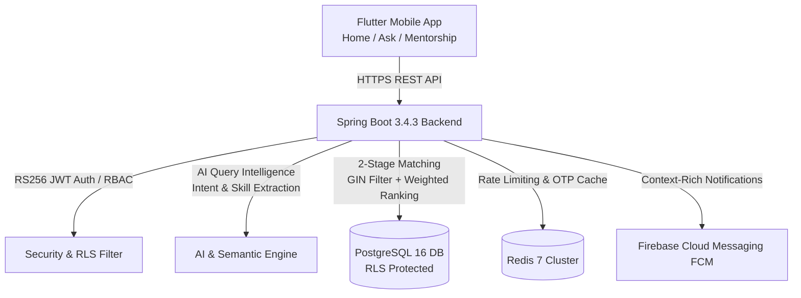
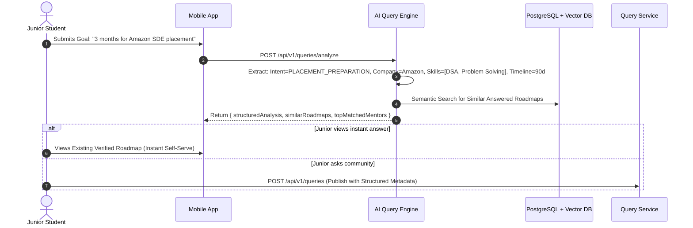
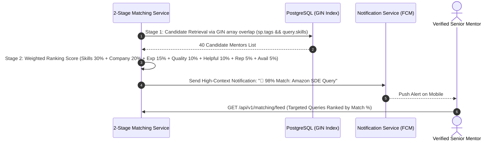
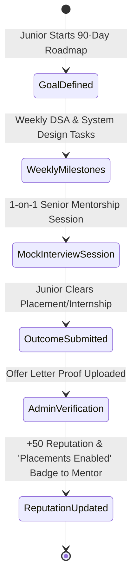
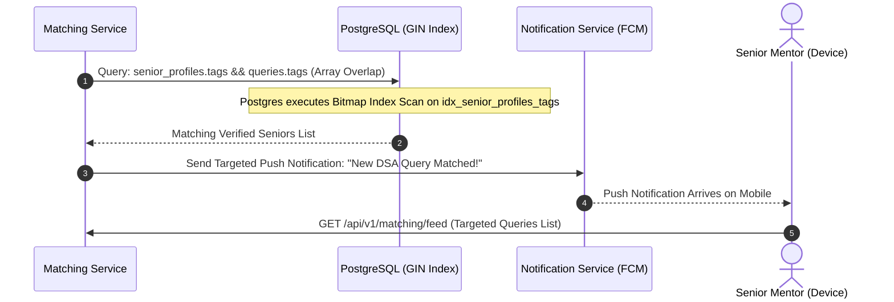
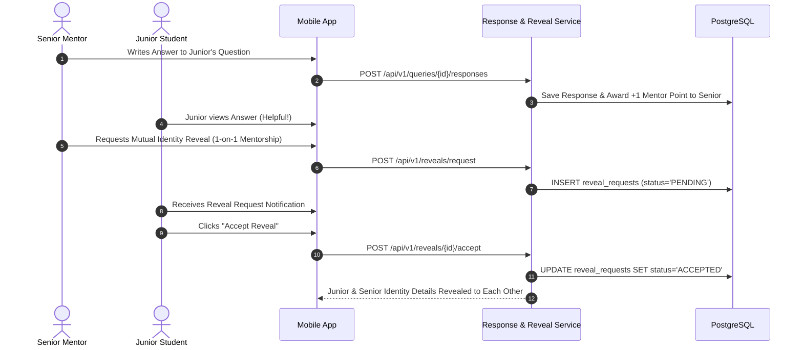
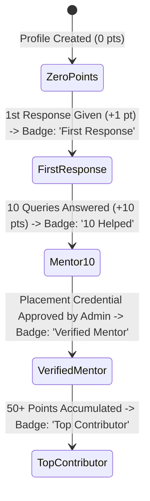
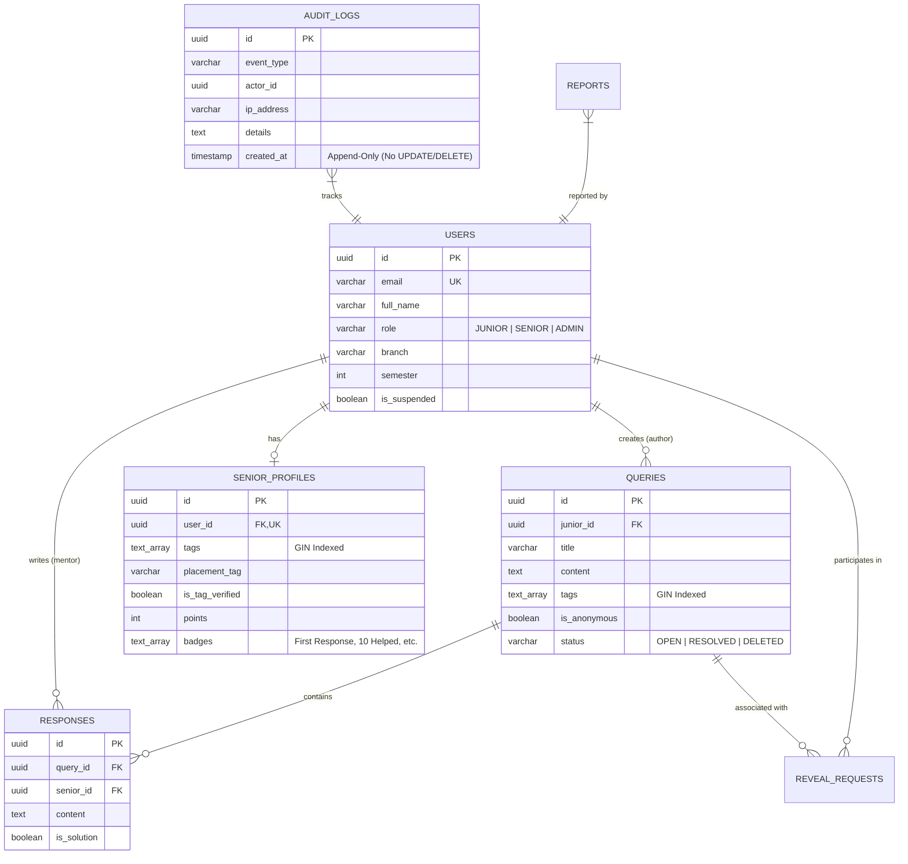

# CampusBuddy V2 — Complete Project Flow & Lifecycle Guide

CampusBuddy V2 ek intelligent, outcome-driven mentorship platform hai jo **Juniors** (asking questions & pursuing career goals) aur **Verified Mentors** (seniors & alumni) ko connect karke measurable career outcomes (Interviews, Internships, Job Offers) achieve karwata hai.

---

## 🏗️ 1. CampusBuddy V2 System Architecture



---

## 👥 2. User Roles & Personas

| Role | Access & Capabilities |
|---|---|
| **Junior (Student)** | - Domain-restricted college email / OAuth login.<br/>- Goal formulation with AI Query Analysis.<br/>- Anonymous & public questions post karna.<br/>- Mentorship roadmap subscribe karna & weekly tasks complete karna.<br/>- 4-Tier Privacy control (Level 0 Anonymous → Level 3 Direct Mentorship). |
| **Senior (Mentor)** | - Verified domain account with achievement credentials (Offer letters verified via multi-modal OCR).<br/>- 2-Stage targeted matching feed with match percentage.<br/>- Goal roadmap guidance, 1-on-1 sessions & feedback provide karna.<br/>- Outcome-driven reputation badges (Placements Enabled, Top Contributor). |
| **Admin** | - Platform moderation, verification triage, outcome validation, and append-only audit logs access. |

---

## 🔄 3. End-to-End V2 Core Flows

### 📌 Flow 1: AI Query Intelligence & Similar Questions Discovery Flow



---

### 📌 Flow 2: 2-Stage Intelligent Mentor Matching Flow



---

### 📌 Flow 3: Mentorship Roadmap, Sessions & Outcome Verification Flow


sequenceDiagram
    autonumber
    actor Junior as Junior Student
    participant App as Mobile App
    participant Filter as RlsSessionFilter
    participant QuerySvc as Query Service
    participant DB as PostgreSQL (RLS Enforced)

    Junior->>App: Query Create: Title, Description, Tags ["DSA", "Amazon", "Interview"]
    App->>QuerySvc: POST /api/v1/queries (Bearer JWT)
    QuerySvc->>QuerySvc: XSS Input Sanitization (Jsoup)
    QuerySvc->>Filter: Set app.current_user_id = Junior.UUID
    QuerySvc->>DB: INSERT INTO queries (is_anonymous=true, tags=TEXT[])
    DB-->>QuerySvc: Saved Query Row
    QuerySvc-->>App: Query Created (Author ID stripped)
```

---

### 📌 Flow 3: Smart Tag Matching & FCM Notification Flow



---

### 📌 Flow 4: Senior Response & Mutual Consent Reveal Flow



---

### 📌 Flow 5: Gamification Badges & Milestone Evaluation Flow



---

## 🗄️ 4. Database Schema & Security Isolation



---

## 🚀 5. How to Run Locally

### 1. Backend (Spring Boot)
```powershell
# Navigate to backend directory
cd d:\projects\capmusbuddy\seniorconnect-backend

# Run with Maven
mvn spring-boot:run
```
*API runs at: `http://localhost:8080/api/v1`*

### 2. Full Stack with Docker
```powershell
cd d:\projects\capmusbuddy
docker-compose up -d
```

### 3. Mobile App (Flutter)
```powershell
cd d:\projects\capmusbuddy\seniorconnect-mobile
flutter pub get
flutter run
```

---

## 🧪 6. Test Suite & Verification

All 25 backend integration tests & mobile widget tests can be run via:

```powershell
# Backend (25/25 Integration & Unit Tests)
cd d:\projects\capmusbuddy\seniorconnect-backend
mvn -B clean test

# Mobile (Widget Tests & Analyzer)
cd d:\projects\capmusbuddy\seniorconnect-mobile
flutter test
flutter analyze
```
